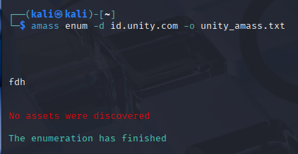
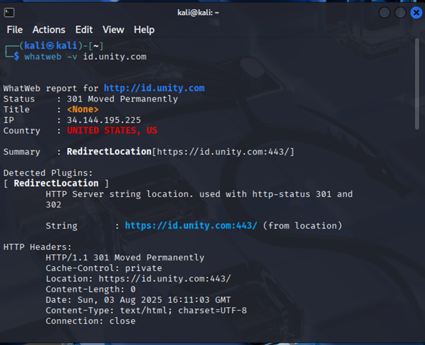
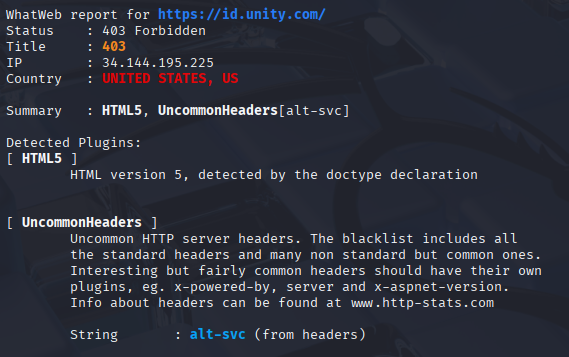
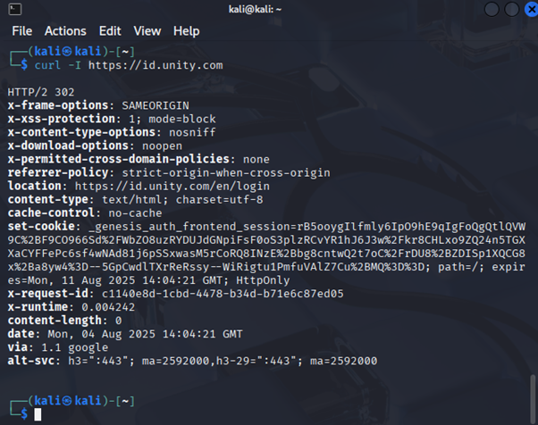
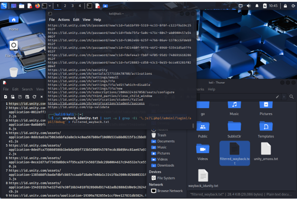
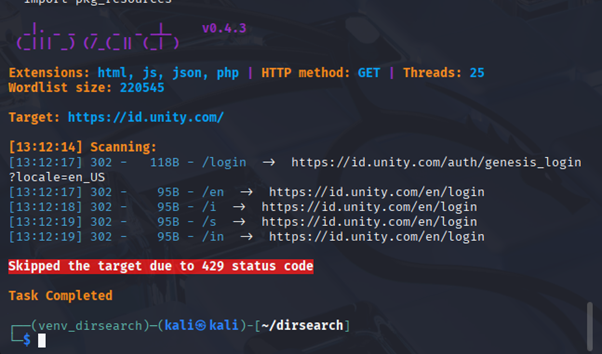

# Reconnaissance Report: id.unity.com

## Target
**Domain:** `id.unity.com`  
**Engagement Type:** Web Application Testing (Bug Bounty)

---

## 1. Subdomain Enumeration Attempt

### Objective
To perform reconnaissance by discovering subdomains associated with the target domain `id.unity.com` in order to identify potential attack surfaces.

### Tools Used
- **Amass**: A reconnaissance tool for subdomain discovery

### Command Executed and Outcome
```
amass enum -d id.unity.com -o unity_amass.txt
```
Amass reported:
```
No assets were discovered
```



### Analysis
- The target domain `id.unity.com` appears to be a subdomain itself.
- This reduces the likelihood of discovering further subdomains using standard enumeration tools like Amass.
- As a result, it was determined that subdomain enumeration may not be the most effective strategy in this case.

### Strategy Revision
The focus will shift from subdomain discovery to direct web application analysis and security testing of the main subdomain (`id.unity.com`).

---

## 2. Web Fingerprinting using WhatWeb

### Objective
To identify technologies and server configurations used by the target id.unity.com by performing web fingerprinting. This helps gather preliminary information before deeper analysis.

### Tools Used
WhatWeb: A web scanner that detects technologies used by websites via HTTP responses.

### Command Executed
```
whatweb -v id.unity.com
```

### Findings
```
HTTP (http://id.unity.com)

Status: 301 Moved Permanently

Redirected to: https://id.unity.com:443/

HTTPS (https://id.unity.com)

Status: 403 Forbidden

Detected Plugins:

HTML5: Detected via doctype declaration

UncommonHeaders: Header alt-svc was present

Response Headers (HTTPS):
HTTP/1.1 403 Forbidden  
Content-Length: 134  
Content-Type: text/html; charset=UTF-8  
Date: Sun, 03 Aug 2025 16:11:08 GMT  
Alt-Svc: h3=":443"; ma=2592000,h3-29=":443"; ma=2592000  
Connection: close
```  
### Analysis
The target redirects from HTTP to HTTPS, enforcing secure access.

The server blocks direct access with a 403 Forbidden response, possibly due to IP geofiltering, rate limiting, or user-agent filtering.

No server technology (e.g., Apache, Nginx) was exposed in the headers, which may indicate hardened configurations or use of CDN/WAF

### screenshots



---

## 3. WHOIS Information Gathering

### Objective
To gather domain registration and ownership information about the main domain unity.com for passive reconnaissance purposes. Although the testing scope is limited to id.unity.com, analyzing the WHOIS data of the parent domain can provide insight into the organization's structure and hosting choices.

### Tool Used
whois: A command-line utility to retrieve WHOIS database information.

### Command Executed
```
whois unity.com
Summary of Results
markdown
Copy
Edit
Domain Name: unity.com
Registrar: MarkMonitor Inc.
Registrant Organization: Unity Technologies SF
Creation Date: 1995-08-07
Expiry Date: 2026-08-06
Domain Status:
  - clientDeleteProhibited
  - clientTransferProhibited
  - clientUpdateProhibited
  - serverDeleteProhibited
  - serverTransferProhibited
  - serverUpdateProhibited
Name Servers:
  - asia3.akam.net
  - eur2.akam.net
  - eur5.akam.net
  - ns1-105.akam.net
  - ns1-8.akam.net
  - usc4.akam.net
  - use4.akam.net
  - usw4.akam.net
DNSSEC: unsigned
```

## Analysis
The domain unity.com is managed by MarkMonitor, a registrar commonly used by large enterprises.

The domain has been registered since 1995, indicating a well-established organization.

Name servers point to Akamai, suggesting use of a Content Delivery Network or Web Application Firewall.

Various domain status flags prevent unauthorized transfers or changes, indicating strong administrative control.

---

## 3. HTTP Header Analysis

### Objective
To inspect the HTTP response headers returned by the server to gather insights on security configurations, redirection behavior, and caching policies.

### Tool Used
- `curl`: A command-line tool for transferring data with URLs.

### Command Executed
```
curl -I https://id.unity.com
Response Headers
pgsql
Copy
Edit
HTTP/2 302 
x-frame-options: SAMEORIGIN
x-xss-protection: 1; mode=block
x-content-type-options: nosniff
x-download-options: noopen
x-permitted-cross-domain-policies: none
referrer-policy: strict-origin-when-cross-origin
location: https://id.unity.com/en/login
content-type: text/html; charset=utf-8
cache-control: no-cache
set-cookie: _genesis_auth_frontend_session=... (truncated)
x-request-id: c1140e8d-1cbd-4478-b34d-b71e6c87ed05
x-runtime: 0.004242
content-length: 0
date: Mon, 04 Aug 2025 14:04:21 GMT
via: 1.1 google
alt-svc: h3=":443"; ma=2592000,h3-29=":443"; ma=2592000
```

### Analysis

HTTP Status Code: 302 Found indicates redirection to /en/login, confirming that direct access to the root page leads to the login interface.

Security Headers indicating are these,

x-frame-options: SAMEORIGIN: Prevents clickjacking by disallowing the site to be framed by other origins.

x-xss-protection: 1; mode=block: Enables basic XSS filter in legacy browsers.

x-content-type-options: nosniff: Prevents MIME-sniffing attacks.

referrer-policy: strict origin when cross origin: Enhances privacy and reduces information leakage.

Redirection Behavior: The Location header reveals the full redirect URL: https://id.unity.com/en/login.

Set-Cookie: An authentication session cookie is issued, indicating the presence of a login-based application logic.

Cache-Control: no-cache implies dynamic content or authentication-sensitive page.

### Screenshot


---

## 4. Historical URL Discovery

### Objective
To uncover potentially sensitive or legacy endpoints related to id.unity.com by querying archived URLs from the Wayback Machine. This helps identify paths such as admin panels, login endpoints, API routes, or JavaScript files that may expose useful reconnaissance data or attack surfaces.

### Tool Used
waybackurls: A tool that fetches known URLs from the Wayback Machine for a given domain.

### Command Executed
```
waybackurls id.unity.com | tee wayback_idunity.txt
cat wayback_idunity.txt | sort -u | grep -Ei '\.js|\.php|/admin|/login|/api|/debug' > filtered_wayback.txt
Output Summary
Total archived URLs discovered: ~10,000+
```

After filtering for common sensitive patterns (.js, .php, /admin, /login, /api, /debug), 379 relevant endpoints remained.

### Few Examples Of Extract from filtered_wayback.txt

```
https://id.unity.com/en/login, https://id.unity.com/api/v1/tokens, https://id.unity.com/assets/app.js, https://id.unity.com/debug/config, https://id.unity.com/admin/dashboard
```

### Analysis
Several endpoints were revealed from historical data, including login pages, APIs, and JavaScript resources.

Endpoints like /api/v1/tokens and /debug/config may warrant further manual inspection for misconfigurations or sensitive information leaks.

Archived /admin or /login paths indicate possible brute-force or logic flaw testing targets.

### Screenshot


---

## 5. CORS Policy Analysis

### Objective
To test whether id.unity.com allows cross-origin requests by manipulating the Origin header, in order to identify potential CORS misconfigurations.

### Tool Used
curl: Command-line tool to send custom HTTP headers and inspect responses.

### Command Executed and Outcome
```
curl -i -L -H "Origin: https://evil.com" https://id.unity.com
```

### Result:
No Access-Control-Allow-Origin or Access-Control-Allow-Credentials headers were returned in any of the responses, including through multiple HTTP 302 redirects to login and authorization endpoints.

### Analysis
The server does not reflect arbitrary Origin values.

There is no indication of CORS misconfiguration (e.g., no wildcards, no credentialed CORS).

The absence of these headers implies the site rejects cross-origin browser requests, as expected.

### Conclusion
CORS is securely configured on id.unity.com. No misconfigurations or CORS-related vulnerabilities were identified

---

## 6. Authentication Flow and Lockout Behavior

### Objective  
To analyze how the login mechanism works on `id.unity.com`, identify the authentication flow, and observe server responses to invalid credentials.

### Observation  
After entering fake credentials and clicking “Sign in”, the following message was displayed which is

You are temporarily locked out of your account due to successive login failures.

This indicates that
The login request was processed and the server enforces a lockout mechanism.
The presence of this message can be used to distinguish valid user accounts from invalid ones

### Analysis  
This behavior may allow for account enumeration attacks by measuring the server's response to different usernames that are
Valid usernames trigger lockout after repeated attempts.
Invalid usernames do not.

Additionally, no traditional HTML form POST request was observed in the Network tab. This suggests that the login request might be performed via JavaScript-based XHR/fetch or iframe mechanisms, making it more difficult to intercept directly via DevTools.

Further investigation using Burp Suite or deeper JS tracing is required to fully map the authentication flow and check for potential redirect-based exploits or parameter tampering.

---

## 8. Directory Bruteforcing

### Objective  
To discover hidden directories or endpoints in 'id.unity.com' using wordlist-based brute-forcing techniques.

### Tool Used  
- **Tool**: `dirsearch v0.4.3`  
- **Wordlist**: `directory-list-2.3-medium.txt`  
- **Extensions tested**: `.html`, `.js`, `.json`, `.php`

**Code Used:**
```
python3 dirsearch.py -u https://id.unity.com -e html,js,json,php -w /usr/share/wordlists/dirbuster/directory-list-2.3-medium.txt
```
### Screenshot


### Findings

The scan revealed several redirecting paths:

| Path   | Status | Redirect                                 |
|--------|--------|------------------------------------------|
| /login | 302    | /auth/genesis_login?locale=en_US         |
| /en    | 302    | /en/login                                |
| /i     | 302    | /en/login                                |
| /s     | 302    | /en/login                                |
| /in    | 302    | /en/login                                |


These paths demonstrate that the server implements alias-based or language-based routing logic, redirecting various inputs to a central login handler.

The scan was also interrupted by an HTTP 429 Too Many Requests response, indicating that rate limiting is enabled. This limits further brute-force attempts unless delays or proxy rotation are introduced.

### Conclusion
No sensitive directories (e.g., /admin, /debug, /config) were discovered in this scan.
However, the server’s redirect behavior and rate-limiting protections suggest basic anti-enumeration defenses are in place.


